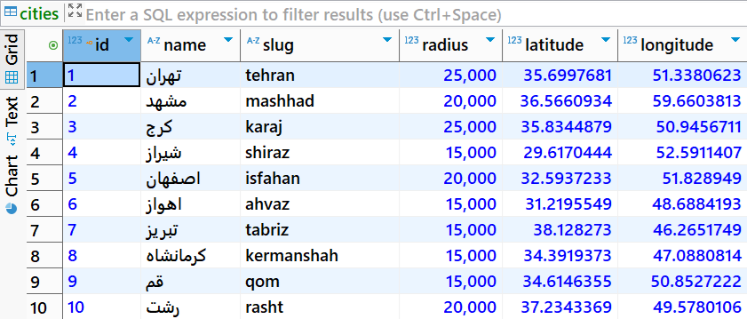

# Divar API to PostgreSQL

A simple ETL pipeline that extracts city data from the Divar API, transforms the JSON response using Pandas, and loads the data into PostgreSQL.

---

## 📌 Project Overview

This project demonstrates a basic data ingestion workflow using Python and PostgreSQL.

The pipeline performs the following steps:

1. Extract data from the Divar public API
2. Transform JSON data into a structured tabular format
3. Load the cleaned data into a PostgreSQL database

---

## 📁 Project Structure

```text
Divar-API-to-Postgres/
│
├── main.py
├── screenshots/
│   └── postgres_output.png
├── requirements.txt
├── .gitignore
├── .env.example
└── README.md
```

---

## 🛠 Technologies Used

- Python
- PostgreSQL
- Pandas
- Requests
- Psycopg2

---

## 🔄 Pipeline Flow

```text
Divar API
    ↓
Extract JSON
    ↓
Transform with Pandas
    ↓
Load into PostgreSQL
```

---

## 🌐 API Endpoint

```text
https://api.divar.ir/v1/places/cities
```

---

## 🗄 PostgreSQL Table Schema

| Column      | Type  |
|-------------|-------|
| ID          | INT   |
| Name        | TEXT  |
| Slug        | TEXT  |
| Radius      | INT   |
| Latitude    | FLOAT |
| Longitude   | FLOAT |

---

## 📊 Sample Output (PostgreSQL Data)



---

## ⚙ Installation

Clone the repository:

```bash
git clone https://github.com/SamiraSiavash/divar-api-to-postgres.git
```

Install dependencies:

```bash
pip install -r requirements.txt
```

---

## ▶ Run the Project

```bash
python main.py
```

---

## ✨ Features

- API data extraction
- JSON normalization using Pandas
- PostgreSQL integration
- Simple ETL workflow
- Structured tabular storage

---

## 🚀 Future Improvements

- Docker support
- Airflow scheduling
- Logging
- Error handling
- Incremental loading
- Data validation

---

## 👩‍💻 Author

**Samira Siavash**

🔗 GitHub: [https://github.com/SamiraSiavash](https://github.com/SamiraSiavash)

🔗 LinkedIn: [https://linkedin.com/in/samira-siavash](https://linkedin.com/in/samira-siavash)
